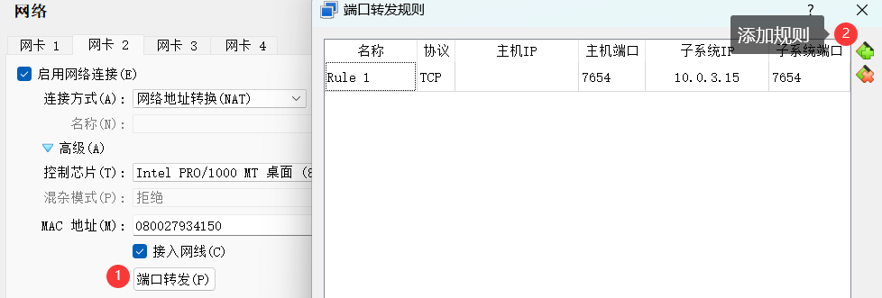
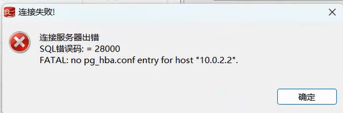
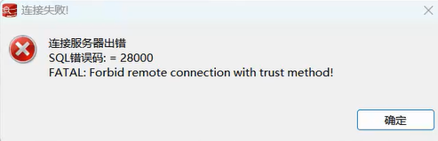
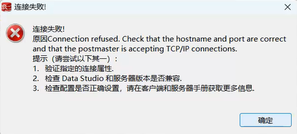
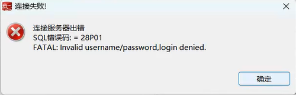
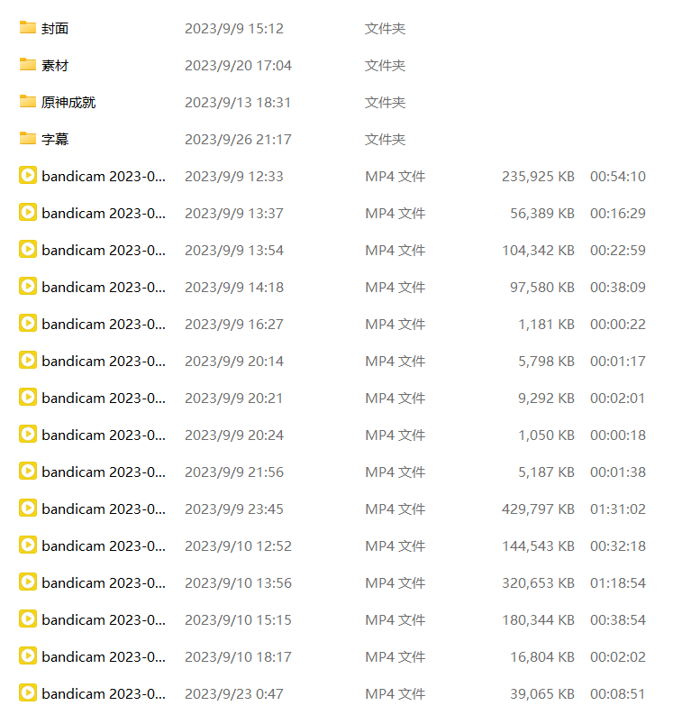

## Q 无法粘贴命令

A 使用 远程连接工具 的好处之一就是可以粘贴


## Q 无法访问虚拟机

A 你的这个问题应该发生在virtualBox中，首先你要排除软件问题，比如防火墙问题。我目前有两种办法

方法一：

在新建虚拟机时添加一张主机网卡


这样他就会像和主机一样处于同一个”局域网“当中，之后你可以在网络上搜索配置方法。之后就可以直接访问他，像VMware的NAT

方法二：

设置端口映射（转发）



把你想要访问端口映射到你的主机上（127.0.0.1）

# DataStudio上的提示

## Q 连接服务器出错

错误码 28000

no **pg_hab.conf** entry for **host "X.X.X.X"**



A 大概意思就是访问IP没有权限，你没有权限连接他。

请在 pg_hba.conf 中添加你的IP，例如图中的 10.0.2.2

## Q 连接服务器出错

错误码 28000

Foebid remote connection with **trust** method!



A 大概意思是不能设置为”信任“

请到 postgresql.conf 中修改 密码加密类型，到pg_hba.conf 中修改 METHOD 为相应的加密类型

## Q 连接服务器出错

Connection refused



A 先排除  提示1和提示2

请先检查你的虚拟机是否可以访问，使用PuTTY连接以下就行了；如果PuTTY可以登录，那么你排除防火墙的问题，关闭防火墙之后你应该就可以连接上gauss了。还不行的话请检查意见1和意见2.确认没有错误的话再联系我

# Linux上的错误

## Q 打开 vim 打开文件空白

A 先检查路径有没有输入错误；如果路径没有错误，请用 ```ls```查询文件所在的文件夹下是否本来就存在该文件；

如果是gauss相关的文件不存在，但是应该存在的文件，那么你可以需要添加该文件或者重新安装gauss（你意外的把文件删掉了）


# 其他问题（翻译）

## Q 连接服务器出错

错误码 28P01

Invalid username/password, login denied



A 按照提示，你账户或者密码不对。*部分人在修改加密方式后没有修改密码（使密码被加密）*


# 不用担心错误

试错的过程远不止这些，查看的文档也不止教程列出的寥寥几个




————————————————
