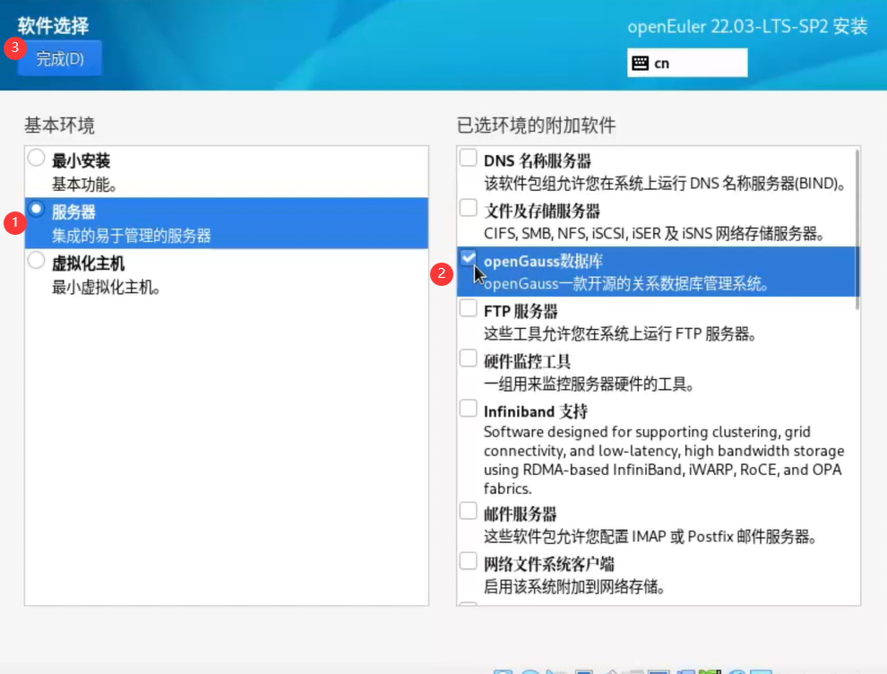

# 虚拟机安装虚拟系统并安装openGauss和使用DataStudio连接

> 2023年9月11日 Kai 未经授权，拒绝转载 （如果你在这无法正常阅读，请把本仓库下载下来，我可能不会来修改图片链接了）

本教程包含下载虚拟机程序、安装虚拟机（openEuler）、安装openGauss、配置gauss访问、下载DataStudio、连接数据库等几个内容

视频教程请在 [bilibili视频合集](https://space.bilibili.com/454077422/channel/seriesdetail?sid=3610773&ctype=0) 中查看

*道路千万条，这里只是其中一条；如果您对虚拟机的安装、Linux的使用、数据库的使用比较熟悉，建议您自行配置；这里提供了简单的教程，更多、更详细的信息希望各位自行搜索*

## 1. 下载虚拟机安装包

可选择virtualBox（官网：[Oracle VM VirtualBox](https://www.virtualbox.org/)）或VMware Workstation（官网：https://www.vmware.com/）

### virtualBox

点击“Download”进去下载界面


在下载页面选择适合自己系统的版本下载


运行安装程序，安装VirtualBox。

*VMware Workstation需要购买，这里不做演示*

## 2. 安装虚拟机程序

程序的安装大同小异，这里不做演示

## 3. 下载openEuler镜像

可选择 openEuler 22/23 ([openEuler | 开源社区 | openEuler社区官网](https://www.openeuler.org/zh/)) 或 openEuler 20 [repo.openeuler.org/openEuler-20.03-LTS-SP1/ISO/](https://repo.openeuler.org/openEuler-20.03-LTS-SP1/ISO/)

### 3.1 openEuler 22/23下载

​	3.1.1 在官网进入下载页面


​	3.1.2 下载适合您的安装镜像

​	

### 3.2 openEuler 20下载 

​	进入镜像源（参考链接）[repo.openeuler.org/openEuler-20.03-LTS-SP1/ISO/](https://repo.openeuler.org/openEuler-20.03-LTS-SP1/ISO/)

	然后根据您的需要选择合适的版本


这里我选择 x86_64 的ISO 镜像

## 4. 安装openEuler22/23（考虑openGauss）

[VMware Workstation安装虚拟机](./使用VMware虚拟机安装openEuler2223.md)

[VirtualBox安装虚拟机](./使用VirtualBox虚拟机安装openEuler2223.md)

## 5. 安装openEuler20 （考虑openGauss）

[VirtualBox安装虚拟机](./使用VirtualBox虚拟机安装openEuler20.md)

*VMware Workstation安装20版本可参考22/23版本，之后的配置请参考VirtualBox安装20版本教程*

## 6. 安装openGauss

6.1 [openEuler20安装openGauss2（请点此跳转文档）](./openEuler20安装openGauss2.md)

6.2 openEuler22/23安装见下

​	在安装过程中我们选择安装openGauss

​	




## 7. 配置openGauss

两种配置类似，差别主要在管理账户上的差别，自己安装时设置的管理员默认是 omm *（可以改，我查的很多教程都是 omm，我也不知道怎么改）*，22/23或更高版本自带的管理员默认就是 opengauss

> 在主教程的第六步安装openGauss中附带了openEuler20配置openGauss的办法，如果你已经完成了配置，不需要再执行一次配置

在openGauss安装时您可能配置了账户名，如 omm，而在openEuler更高版本上自带的 openGauss默认用户是opengauss，您只需要确定您的账户名就可以进行配置，下面以 opengauss 用户名进行：

```
[root@openGaussMachine ~] #

# 设置侦听地址和账户加密方式（这里是22/23系统默认路径，下同）
vim "/var/lib/opengauss/data/postgresql.conf"
# vi "/gaussdb/data/openGuassMachine/pg_hba.conf"  # 这个是我上面设置的安装路径（下同）

# --------- 这里要编辑文件，编辑、保存方式不再赘述 ---------
# 找到 listen_addresses 改为 '*'
listen_addresses = '*'  # 设置侦听地址（这句不是命令，是样例）
# 找到 password_encryption_type 为 0
password_encryption_type = 0  # 设置加密方式（这句不是命令，是样例）
# ----------------------- 保存 -----------------------

# 设置访问许可
vim /var/lib/opengauss/data/pg_hba.conf
#vi "/gaussdb/data/openGuassMachine/pg_hba.conf"
# ----------------------- 编辑 -----------------------
# 添加IP（这里设置允许全部IP），使用MD5加密
host	all		all		0.0.0.0/0		md5
# ----------------------- 保存 -----------------------

# 关闭防火墙
systemctl disable firewalld.service
systemctl stop firewalld.service

su - opengauss  # 进入gauss 管理账户

# 重启gauss服务
gs_om -t stop  # 关闭服务
gs_om -t start  # 开启服务
# 或者是 /usr/local/opengauss/bin/gs_ctl restart  # 使用 gs_ctl 重启

# 进入初始数据库 postgres （gauss安装完成后自带的数据库）
gsql -d postgres -p 7654 -r
# 7654 端口在刚刚 clusterconfig.xml 中设置了

# 数据库操作指南 [华为官方文档（下载）]( https://support.huaweicloud.com/usermanual-opengauss/GaussDB 用户指南_中国站上线.pdf)

# 变成 postgres=# 说明你已经进入了 postgres 数据库
show port;  # 可以查看端口（其实就是上面的7654）

# 你可以修改一下 omm 账户的密码（建议），使其变成MD5加密保存的密码
alter role omm identified by '新密码' replace '旧密码';
# opengauss账户在第一次使用时要设置密码
ALTER USER opengauss IDENTIFIED BY "你要设置的密码";

# 创建新用户，管理账户不能远程管理 'testuser' 用户名自取
CREATE USER testuser IDENTIFIED BY '你要设置的密码';
ALTER USER testuser SYSADMIN;  # 给予新账户管理权限

\q  # 退出数据库
```


## 8. 下载DataStudio

[Data Studio_数据仓库服务 GaussDB(DWS)_工具指南_华为云 (huaweicloud.com)](https://support.huaweicloud.com/tg-dws/dws_ds_index.html)

> 使用其他类型的数据库远程管理工具的操作与DataStudio相近

选择下载客户端


根据文档指示进行安装

> 是否配置了 Java ？ 在主机命令行运行 java -version，显示 java版本为1.8即说明安装了 Java8


> Tip 建议各位在安装 Java 后参考网络上的教程修改一下 Java 的环境变量

## 9. 使用DataStudio连接数据库


**数据库类型** 旧版直接就是 opengauss，新版选择GaussDB A

**名称** 自行设置，方便自己记忆

**主机:端口** 主机就是openEuler虚拟机的IP，比如10.0.x.x，或者是192.168.x.x，或者是像我设置了端口转发，使用本机地址(127.0.0.1)就可以连接

**数据库** 在本案例中就是使用默认数据库 postgres

**用户名** 在本案例中创建了 testuser来管理数据库，可以使用testuser来登录

**密码** 密码就是 testuser 的密码

**取消SSL** 如果你会配置SSL可以自行配置


## [易出现的问题 文档](./Q&A.md)
