# 使用VirtualBox虚拟机安装openEuler22/23

> 2023年9月10日 Kai 未经授权，谢绝转载

子教程介绍了如何在VMware Workstudio上新建到安装一个虚拟机	这个教程用到的是openEuler系统，在主教程中介绍了openEuler镜像的下载

[返回主教程](./readme.md)

## 1. 新建虚拟机

名称、安装路径根据自己需要设置

**类型** 选择Linux

**版本** 选择 Linux (64-bit)

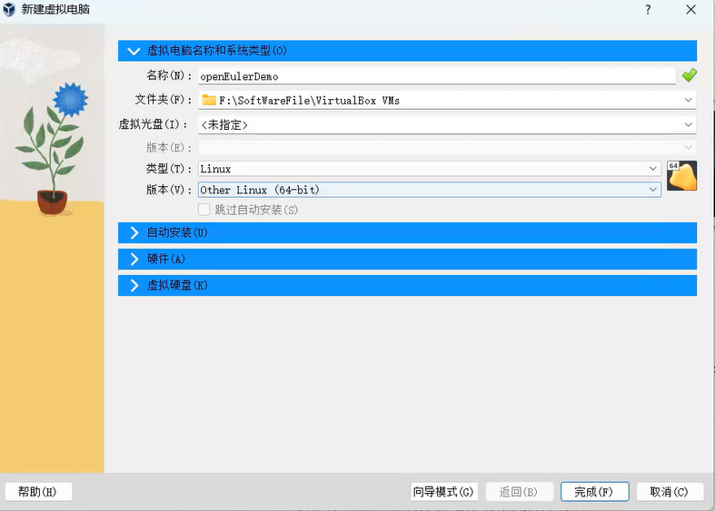

根据自己电脑性能设置内存大小和处理器核数，数值越大，虚拟机越流畅，占用主机资源越多

根据自己情况设置磁盘大小（建议不低于8G）

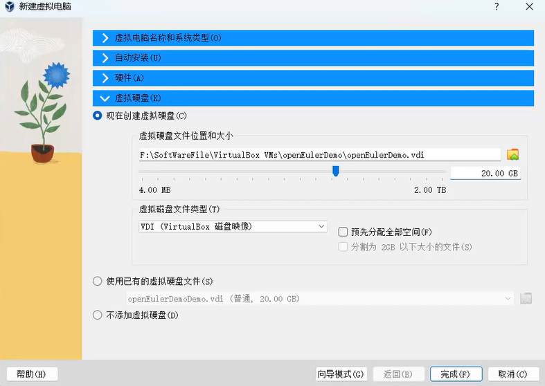

点击“完成”

## 2. 安装openEuler

2.1 设置启动项

选择刚刚新建的虚拟机，点击设置

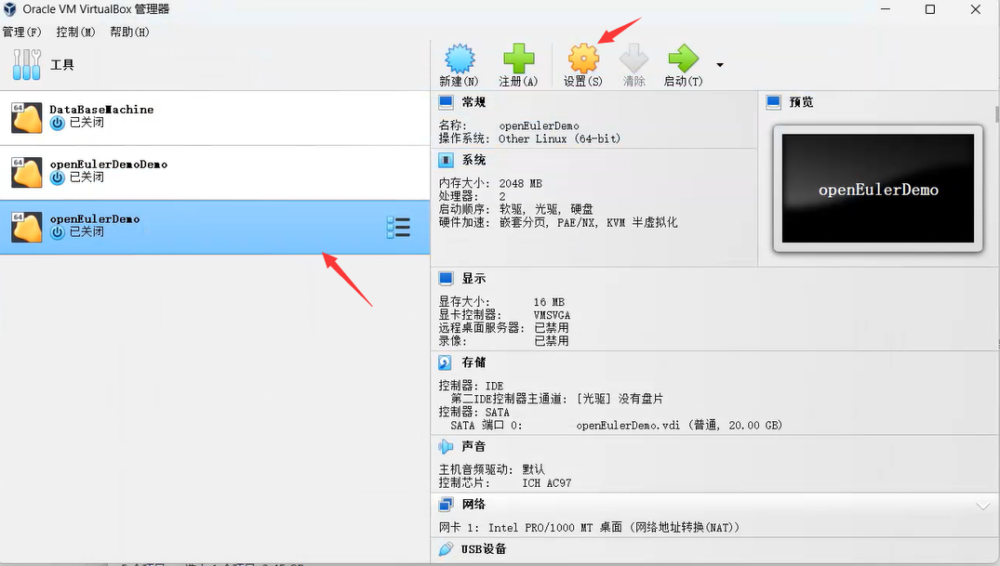

选择“储存“添加虚拟光盘

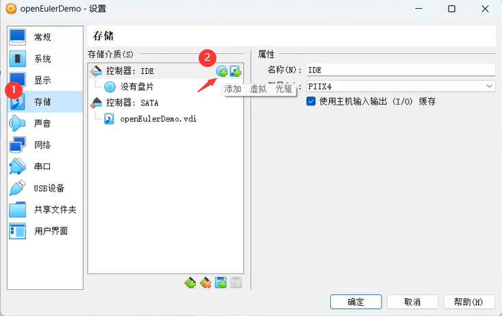

选择要安装的系统映像，然后点击”选择“

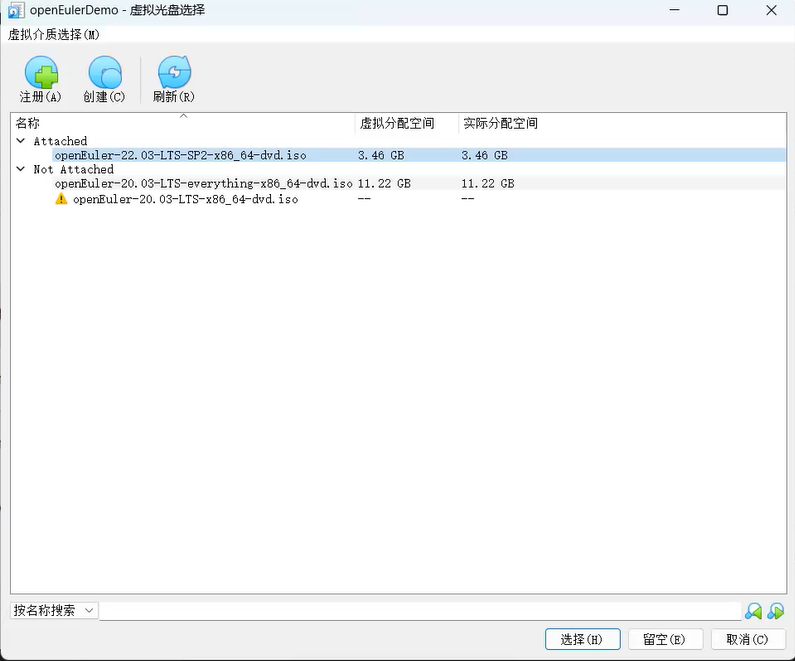

如果列表中没有映像：点击左上角的“注册”，选择下载的ISO镜像，如下，然后打开

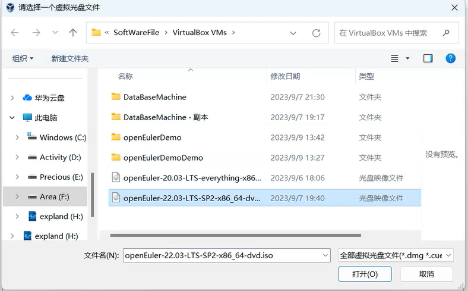

添加完成后，点击“确定”

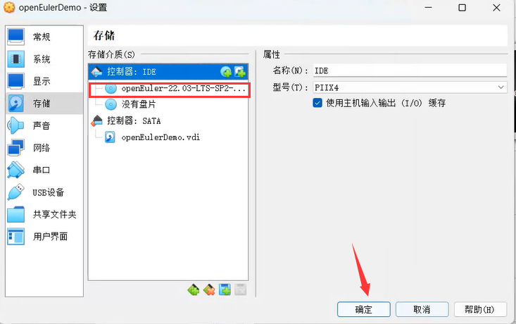

2.2 安装openEuler

选择刚刚新建的虚拟机，“启动”虚拟机，然后选择想要的安装流程。如果在第一种出现问题，可以选择用第二种更详细的查看问题

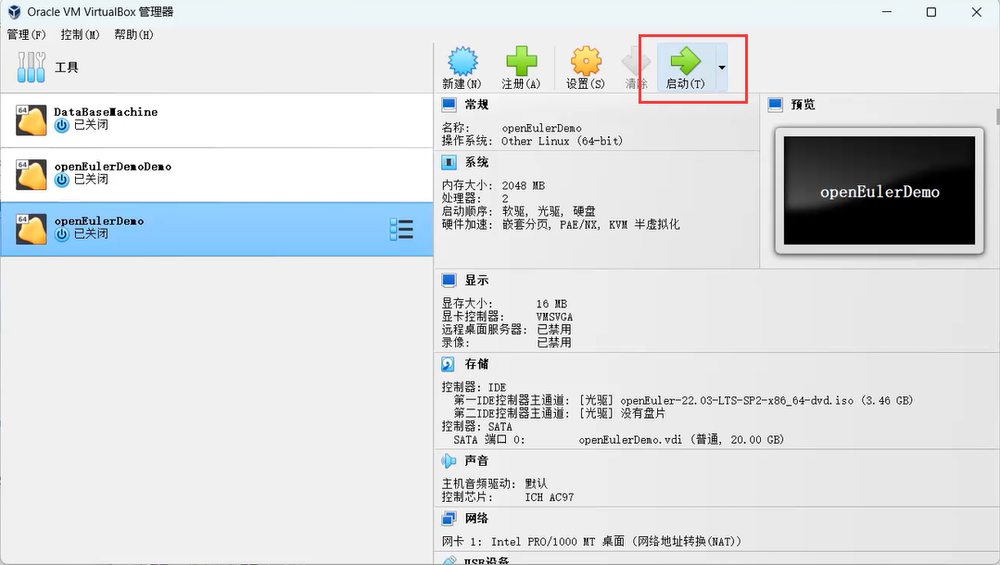

> 右下角 Right Ctrl 提示你，当你键盘鼠标被捕获时，按下 右Ctrl 可以退出捕获（回到主机）

2.3 配置openEuler

等待较长时间后会出现安装界面，

2.3.1 选择语言，根据自己的需要选择语言，然后”继续“（”continue“）

2.3.2 设置存储

**方案1**

选择系统下的”安装目的地“

选择虚拟磁盘

选择”完成“

**方案2**

这里拿20版本的示例

在上方选择该磁盘后选择“自定义”

点击“完成”后跳转到 手动分区 界面

”点击这里自动创建它们“，然后点击”完成“

在弹出的界面选择”接受更改“

2.3.3 设置网络

选择 系统 下的 网络和主机名

将网络打开

2.3.4 选择软件

选择 软件 下的 软件选择

选择自己需要的程序，主教程附带openGauss的安装，这里顺带选上（这是openEuler22/23版本）

点击完成

2.3.5 设置账户

设置root账户（推荐）

启用root账户，并设置密码（三种类型，长度8位及以上）

然后”完成“

2.4 开始安装

点击”开始安装“，开始安装

2.5 取消安装程序（或者”我已完成安装“）

安装完成后重启系统

然后强制关闭系统

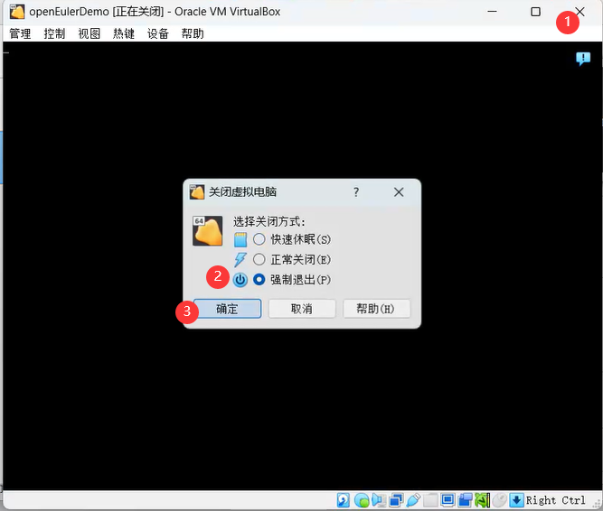

取消映像启动

还是在设置里

在“存储”中，找到刚刚的盘片，[右击]后选择删除，然后确定

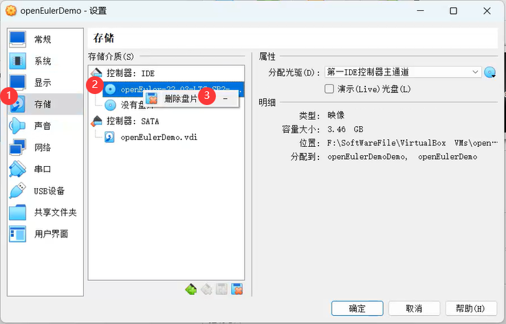

**法二**

在“系统”启动顺序中，取消勾选“光驱”

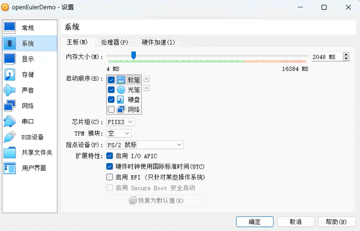

## 3. 进入系统

重新启动虚拟机，之后会进入操作界面

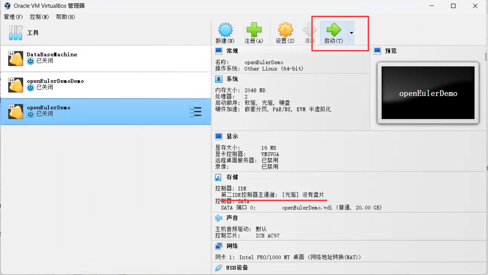

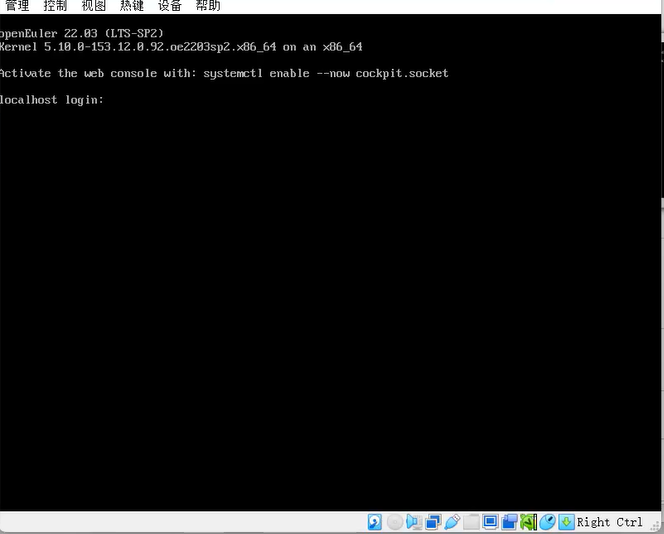

你已经成功安装了openEuler22

[返回主教程](./readme.md)

************************

不同的虚拟机安装都类似，主要就是配置”类型“，之后就是设置内存、磁盘等等

